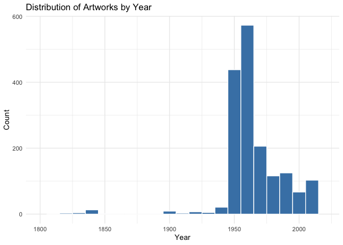
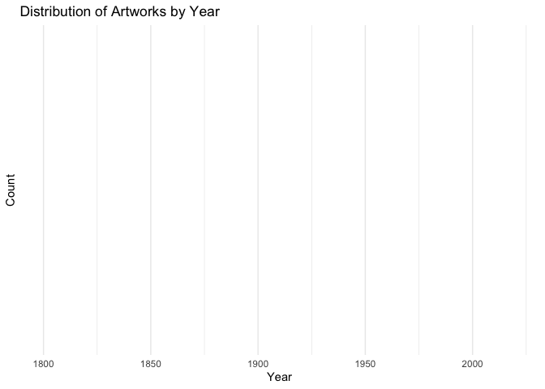

Lab 08 - University of Edinburgh Art Collection
================
Cynthia Jiao
03/04/2025

## Load Packages and Data

First, let’s load the necessary packages:

``` r
library(tidyverse) 
library(skimr)
library(robotstxt)
library(rvest)
library(dplyr)
```

Now, load the dataset. If your data isn’t ready yet, you can leave
`eval = FALSE` for now and update it when needed.

``` r
# Remove eval = FALSE or set it to TRUE once data is ready to be loaded

paths_allowed("https://collections.ed.ac.uk/art)")
```

    ## [1] TRUE

``` r
#### see the web scraping scripts in 01-scrape-page-one.R

#### see turning web scraping script to functions in 02-scrape-page-function.R

#### see using root & sequence to scrape all pages and turning into csv file in 03-scrape-page-many.R

uoe_art <- read_csv("data/uoe-art.csv")
```

## Exercise 9

Let’s start working with the **title** column by separating the title
and the date:

``` r
uoe_art <- uoe_art %>%
  separate(Title, into = c("Title", "Date"), sep = "\\(") %>%
  mutate(Year = str_remove(Date, "\\)") %>% as.numeric()) %>%
  select(Title, Artist, Year, Link) 
```

    ## Warning: Expected 2 pieces. Additional pieces discarded in 47 rows [182, 195, 209, 533,
    ## 729, 732, 771, 775, 781, 879, 982, 1029, 1041, 1045, 1132, 1176, 1279, 1336,
    ## 1358, 1359, ...].

    ## Warning: Expected 2 pieces. Missing pieces filled with `NA` in 697 rows [4, 15, 17, 22,
    ## 26, 27, 30, 31, 32, 34, 39, 41, 44, 53, 58, 63, 78, 82, 86, 93, ...].

    ## Warning: There was 1 warning in `mutate()`.
    ## ℹ In argument: `Year = str_remove(Date, "\\)") %>% as.numeric()`.
    ## Caused by warning in `str_remove(Date, "\\)") %>% as.numeric()`:
    ## ! NAs introduced by coercion

## Exercise 10

The warning message above means that there is no integer number in the
(), meaning that there is no available, single number year following the
title. We can leave it as is, because r returns a NA instead.

## Exercise 11

There are 1580 art work with missing years, 111 art work with missing
artist (if “unknown” doesn’t count as missing artists).

``` r
skim(uoe_art)
```

|                                                  |         |
|:-------------------------------------------------|:--------|
| Name                                             | uoe_art |
| Number of rows                                   | 3312    |
| Number of columns                                | 4       |
| \_\_\_\_\_\_\_\_\_\_\_\_\_\_\_\_\_\_\_\_\_\_\_   |         |
| Column type frequency:                           |         |
| character                                        | 3       |
| numeric                                          | 1       |
| \_\_\_\_\_\_\_\_\_\_\_\_\_\_\_\_\_\_\_\_\_\_\_\_ |         |
| Group variables                                  | None    |

Data summary

**Variable type: character**

| skim_variable | n_missing | complete_rate | min | max | empty | n_unique | whitespace |
|:--------------|----------:|--------------:|----:|----:|------:|---------:|-----------:|
| Title         |         0 |          1.00 |   0 |  95 |     5 |     1629 |          0 |
| Artist        |       111 |          0.97 |   2 |  55 |     0 |     1198 |          0 |
| Link          |         0 |          1.00 |  26 |  29 |     0 |     3312 |          0 |

**Variable type: numeric**

| skim_variable | n_missing | complete_rate |    mean |    sd |  p0 |  p25 |  p50 |  p75 | p100 | hist  |
|:--------------|----------:|--------------:|--------:|------:|----:|-----:|-----:|-----:|-----:|:------|
| Year          |      1580 |          0.52 | 1964.56 | 53.22 |   2 | 1953 | 1962 | 1977 | 2020 | ▁▁▁▁▇ |

## Exercise 11 & 12

From the graph, the number of artworks rises drastically during 1950s
and 1960s. There is almost no artwork listed from 1850 to 1900, which is
not normal because there are (and should be) many artworks from 19th
century.

``` r
uoe_art %>%
  ggplot(aes(x = Year)) +
  geom_histogram(binwidth = 10, fill = "steelblue", color = "white") +
  scale_x_continuous(limits = c(1800, max(uoe_art$Year, na.rm = TRUE))) + 
  labs(title = "Distribution of Artworks by Year", x = "Year", y = "Count") +
  theme_minimal()
```

    ## Warning: Removed 1581 rows containing non-finite outside the scale range
    ## (`stat_bin()`).

    ## Warning: Removed 2 rows containing missing values or values outside the scale range
    ## (`geom_bar()`).

<!-- -->

## Exercise 13

Many artworks between 1850s to 1900s are not captured by our codes
because older works can only have estimated year, which could be a range
than a precise year (e.g., 1836-1837). In this case, our codes will miss
them and return a NA. Therefore, I edited the codes so that it will keep
the first 4 digits if there is a range of years inside of the (). After
the edits, the new dataset have 1042 missing year.

``` r
uoe_art_fixed <- uoe_art %>%
  separate(Title, into = c("Title", "Date"), sep = "\\(") %>%
  mutate(Year = str_extract(Date, "\\d{4}") %>% as.numeric()) %>%  # extracts the first 4-digit number (year)
  select(Title, Artist, Year, Link)
```

    ## Warning: Expected 2 pieces. Missing pieces filled with `NA` in 3312 rows [1, 2, 3, 4, 5,
    ## 6, 7, 8, 9, 10, 11, 12, 13, 14, 15, 16, 17, 18, 19, 20, ...].

``` r
skim(uoe_art_fixed)
```

|                                                  |               |
|:-------------------------------------------------|:--------------|
| Name                                             | uoe_art_fixed |
| Number of rows                                   | 3312          |
| Number of columns                                | 4             |
| \_\_\_\_\_\_\_\_\_\_\_\_\_\_\_\_\_\_\_\_\_\_\_   |               |
| Column type frequency:                           |               |
| character                                        | 3             |
| numeric                                          | 1             |
| \_\_\_\_\_\_\_\_\_\_\_\_\_\_\_\_\_\_\_\_\_\_\_\_ |               |
| Group variables                                  | None          |

Data summary

**Variable type: character**

| skim_variable | n_missing | complete_rate | min | max | empty | n_unique | whitespace |
|:--------------|----------:|--------------:|----:|----:|------:|---------:|-----------:|
| Title         |         0 |          1.00 |   0 |  95 |     5 |     1629 |          0 |
| Artist        |       111 |          0.97 |   2 |  55 |     0 |     1198 |          0 |
| Link          |         0 |          1.00 |  26 |  29 |     0 |     3312 |          0 |

**Variable type: numeric**

| skim_variable | n_missing | complete_rate | mean |  sd |  p0 | p25 | p50 | p75 | p100 | hist |
|:--------------|----------:|--------------:|-----:|----:|----:|----:|----:|----:|-----:|:-----|
| Year          |      3312 |             0 |  NaN |  NA |  NA |  NA |  NA |  NA |   NA |      |

``` r
## visualize again

uoe_art_fixed %>%
  ggplot(aes(x = Year)) +
  geom_histogram(binwidth = 10, fill = "steelblue", color = "white") +
  scale_x_continuous(limits = c(1800, 2020)) + 
  labs(title = "Distribution of Artworks by Year", x = "Year", y = "Count") +
  theme_minimal()
```

    ## Warning: Removed 3312 rows containing non-finite outside the scale range
    ## (`stat_bin()`).

<!-- -->

## Exercise 14

I counted the number of pieces by artists, and it seems that Unknown is
the most featured artist (373 pieces without an known author). I am not
surprised because there must be a lot of artworks that were sold and
exchanged over the course of 200 years, and it is common that the museum
collects but doesn’t know the exact artist of each work.

``` r
artist_counts <- uoe_art %>%
  group_by(Artist) %>%  
  summarise(Count = n()) %>%  
  arrange(desc(Count))

# View the result
print(artist_counts)
```

    ## # A tibble: 1,199 × 2
    ##    Artist           Count
    ##    <chr>            <int>
    ##  1 Unknown            373
    ##  2 Emma Gillies       175
    ##  3 <NA>               111
    ##  4 Ann F Ward          23
    ##  5 John Bellany        22
    ##  6 Zygmunt Bukowski    21
    ##  7 Boris Bućan         17
    ##  8 Marjorie Wallace    17
    ##  9 Gordon Bryce        16
    ## 10 William Gillon      16
    ## # ℹ 1,189 more rows

## Exercise 15

I tried to detect the word “child” using the same code, but nothing
shows up, which could be that all titles are in title case and all the
“C”s in “child” is capitalized. So I switched to detect “Child”, and it
shows that there are 11 art pieces have the word “child” in their title.

``` r
child_counts <- uoe_art_fixed %>%
  filter(str_detect(uoe_art_fixed$Title, "Child")) 

print(child_counts)
```

    ## # A tibble: 11 × 4
    ##    Title                                                      Artist  Year Link 
    ##    <chr>                                                      <chr>  <dbl> <chr>
    ##  1 "The Sun Dissolves while Man Looks Away from the Unborn C… Eduar…    NA ./re…
    ##  2 "Virgin and Child"                                         Unkno…    NA ./re…
    ##  3 "Virgin and Child "                                        Unkno…    NA ./re…
    ##  4 "Woman with Child and Still Life "                         Cathe…    NA ./re…
    ##  5 "Virgin and Child "                                        Unkno…    NA ./re…
    ##  6 "Child's collar. Chinese"                                  Unkno…    NA ./re…
    ##  7 "Child's chinese headdress"                                Unkno…    NA ./re…
    ##  8 "Figure Composition with Nurse and Child, and Woman with … Edwar…    NA ./re…
    ##  9 "Untitled - Children Playing "                             Monik…    NA ./re…
    ## 10 "The Children's Hour "                                     Eduar…    NA ./re…
    ## 11 "Untitled - Portrait of a Woman and Child "                Willi…    NA ./re…
